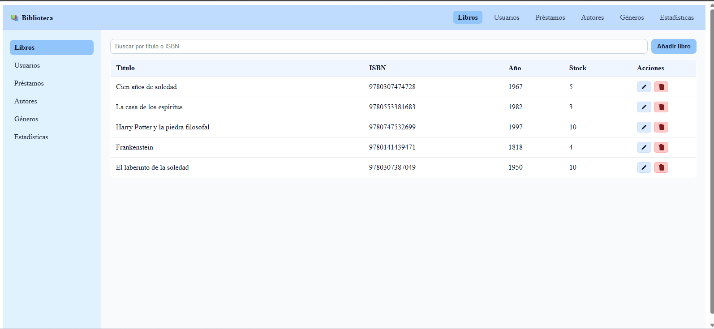
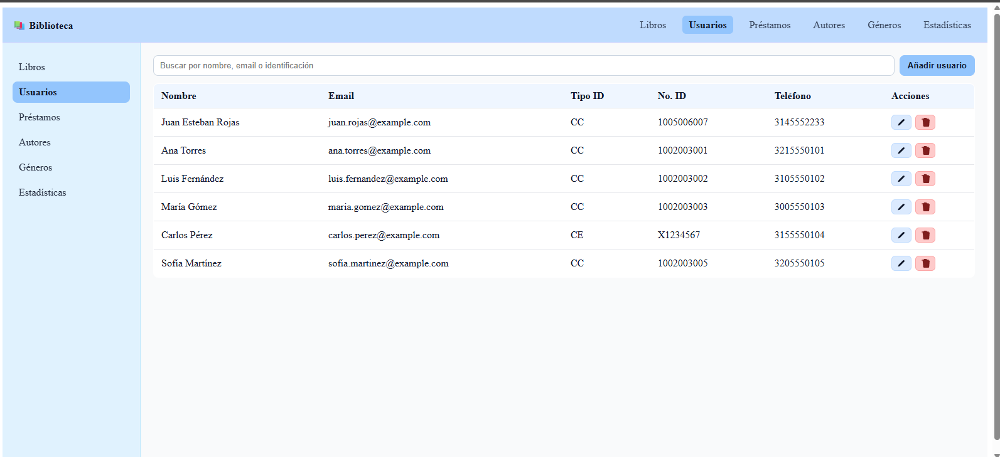
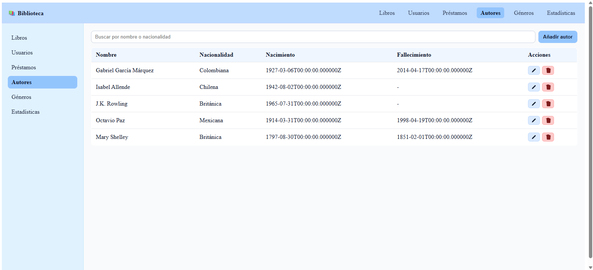
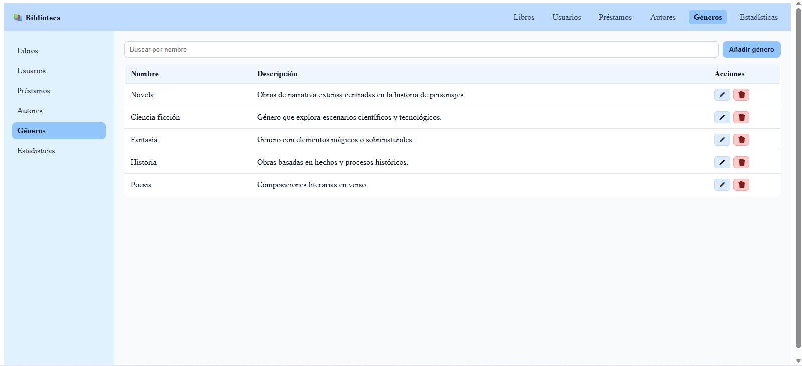
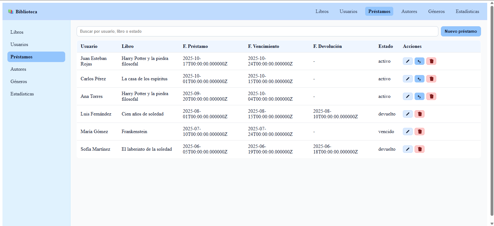
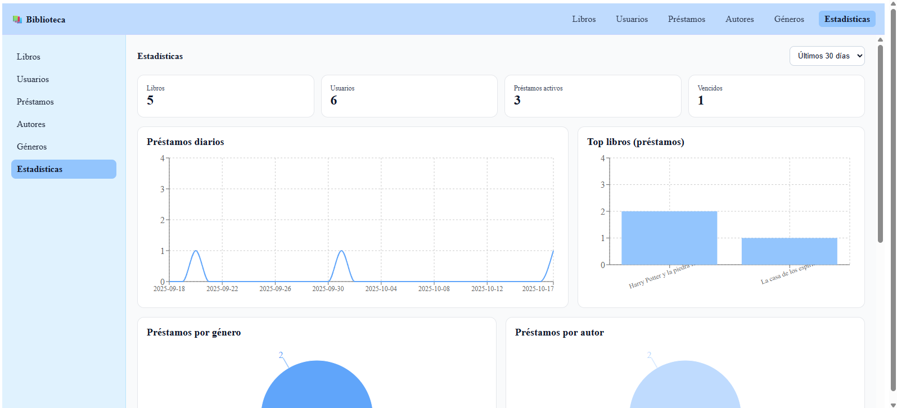

  
  <h1 style="margin: 8px 0 0;">Sistema de Biblioteca</h1>
  
Laravel 11 (API) + React TypeScript (Frontend)

  
CRUDs, Préstamos con reglas de negocio y Dashboard de Estadísticas

  
<b>Presentación — Miguel Santiago Velásquez</b>

  

    

      Soy <b>Miguel Santiago Velásquez</b>, Desarrollador <b>Full‑Stack Junior</b> con enfoque en frontend. 
      Mi fuerte es <b>React + TypeScript</b>; también manejo <b>JavaScript, HTML5, CSS, Bootstrap</b> y nociones básicas de <b>Angular</b>.
    

    

      En backend, mi base es <b>C# / ASP.NET</b>, y también trabajo con <b>PHP / Laravel</b> y <b>Python / FastAPI,</b> <b>He manejado bases de datos con MySQL y SQLServer (bases de datos SQL Y NOSQL)</b>.
      Tengo <b>26 años</b>; inicié en programación hace dos años y me apasiona construir aplicaciones que <b>automatizan procesos</b> y hacen la vida más fácil a las personas.
    

    

      Experiencia: 1 año como desarrollador backend en <b>Intelisoft Software S.A.S</b>.
      Formación: <b>Análisis y Desarrollo de Software</b> (SENA), en proceso de certificación.
      Me caracterizo por ser <b>responsable, dedicado y proactivo</b>, con gusto por el <b>análisis</b> y la <b>lógica</b> para resolver problemas.
    

  

 

<h2>Arquitectura y Alcance</h2>

<ul>
  <li><b>Monorepo</b>
    <ul>
      <li><code>backend/</code> — API REST con Laravel 11</li>
      <li><code>frontend/</code> — UI con React + TypeScript + Vite</li>
    </ul>
  </li>
  <li><b>Dominio</b>: gestión de <i>usuarios</i>, <i>autores</i>, <i>géneros</i>, <i>libros</i> y <i>préstamos</i> (con reglas de stock y devolución)</li>
  <li><b>Estadísticas</b>: overview, top de libros, préstamos por género/autor, tasas (a tiempo/vencidos), disponibilidad y serie diaria</li>
  <li><b>Documentación</b>: Swagger UI en <code>/api/documentation</code></li>
  <li><b>Validaciones</b>: Form Requests en backend (Libros/Préstamos) + validaciones básicas en formularios del frontend</li>
  <li><b>Tests</b>: set básico de unit tests para reglas de préstamos</li>
</ul>

<h2>Requisitos</h2>
<ul>
  <li>PHP &ge; 8.2 (extensiones: bcmath, fileinfo, mbstring, openssl, pdo_mysql, curl, xml, zip)</li>
  <li>Composer 2.x</li>
  <li>Node.js 18+ (recomendado 20+), npm o pnpm</li>
  <li>MariaDB/MySQL en local</li>
</ul>

<h2>Inicio Rápido</h2>

<h3>1) Backend (Laravel 11)</h3>

<pre>
cd backend
composer install
cp .env.example .env   # (en Windows: copy .env.example .env)
php artisan key:generate

# Configura en .env tu base de datos
DB_CONNECTION=mysql
DB_HOST=127.0.0.1
DB_PORT=3306
DB_DATABASE=prueba_biblioteca
DB_USERNAME=root
DB_PASSWORD=

php artisan migrate
php artisan serve     # http://127.0.0.1:8000
</pre>

<h3>2) Frontend (React + Vite)</h3>

<pre>
cd frontend
npm install
echo VITE_API_URL=http://127.0.0.1:8000 &gt; .env
npm run dev           # http://localhost:5173
</pre>

<h3>3) Swagger UI</h3>

<ul>
  <li>URL local: <code>http://127.0.0.1:8000/api/documentation</code></li>
</ul>

<h2>Estructura Clave</h2>

  
<b>Backend</b>

  <ul>
    <li><code>app/Models</code>: Usuario, Autor, Genero, Libro, Prestamo</li>
    <li><code>app/Http/Controllers/Api</code>: CRUDs + devolución de préstamos</li>
    <li><code>app/Services</code>: <b>LibroService</b> (sincroniza autores/géneros), <b>PrestamoService</b> (stock, duplicados, devolución, transacciones)</li>
    <li><code>routes/api.php</code>: recursos REST + prefijo <code>/estadisticas</code></li>
    <li><code>app/OpenApi</code>: esquemas y anotaciones (L5-Swagger)</li>
    <li><code>tests/Unit/PrestamoServiceTest.php</code>: pruebas unitarias mínimas</li>
  </ul>

  
<b>Frontend</b>

  <ul>
    <li><code>src/layouts</code>: AppLayout (Header + Sidebar)</li>
    <li><code>src/pages</code>: Usuarios, Autores, Géneros, Libros, Préstamos, Estadísticas</li>
    <li><code>src/components</code>: Modal, Form (Input/Select/Button), Pagination, Icons</li>
    <li><code>src/api</code>: instancia axios (<code>VITE_API_URL</code> + <code>/api</code>)</li>
    <li><code>src/types</code>: modelos tipados TS</li>
    <li>Funciones: tablas con búsqueda, paginación, modales CRUD y validaciones básicas</li>
  </ul>

<h2>Características Implementadas</h2>
<ul>
  <li>CRUDs completos de Usuarios, Autores, Géneros y Libros</li>
  <li>Préstamos con reglas de negocio (stock y duplicados), devolución y validaciones de fechas</li>
  <li>Estadísticas: overview, top libres, por género/autor, tasas y disponibilidad; gráficas con Recharts</li>
  <li>Documentación de API con Swagger</li>
  <li>Validaciones básicas en frontend y backend</li>
  <li>Paginación en endpoints y vistas</li>
</ul>

<h2>Capturas</h2>

  
  
  
  
  
  

 

<h2>Notas</h2>
<ul>
  <li>Si tu MySQL usa otro puerto, ajusta <code>DB_PORT</code> en el backend y considera cambiar <code>VITE_API_URL</code> si sirves el backend en otra URL.</li>
  <li>Para búsquedas globales (server-side), se pueden añadir parámetros <code>q</code> a los listados de la API.</li>
  <li>Mejoras futuras: toasts de errores, filtros avanzados, roles/autenticación.</li>
</ul>

Hecho con ❤️ por Miguel Santiago Velásquez

